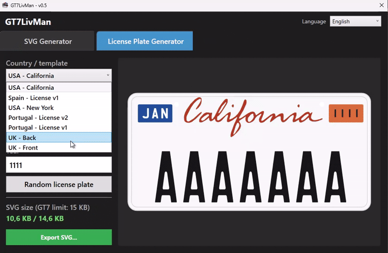
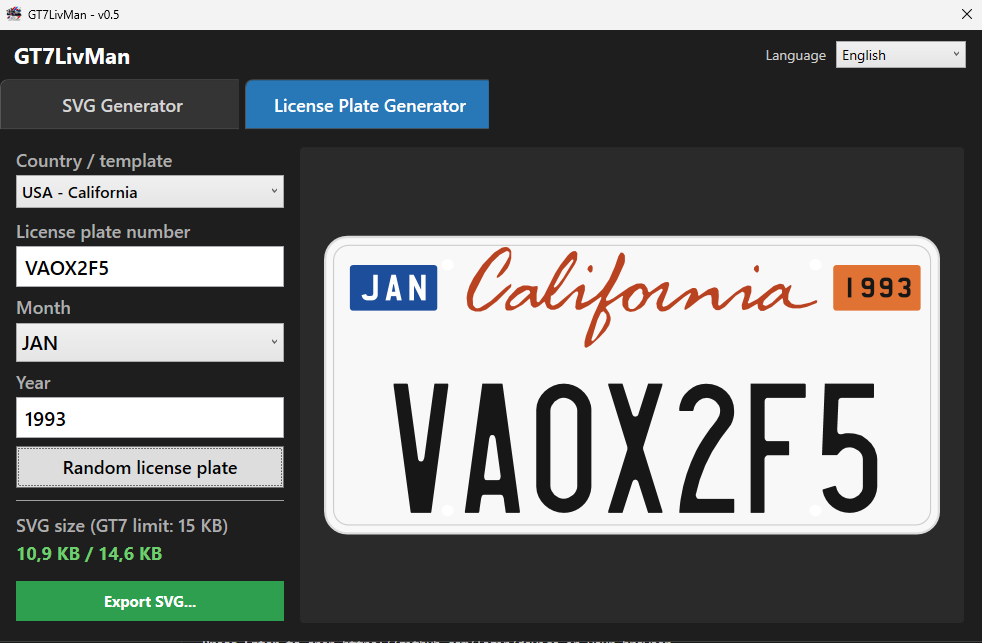
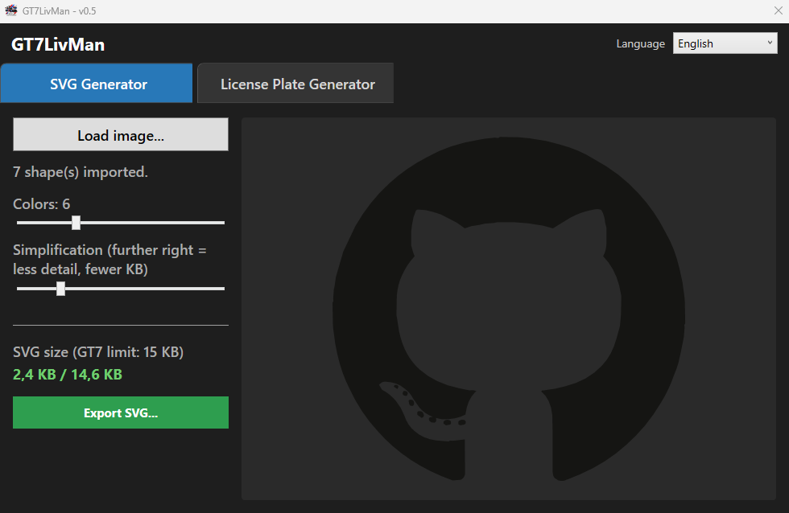

# GT7LivMan

Decal creator for **Gran Turismo 7**, for Windows. It generates SVG files that follow the rules of GT7's official **Decal Uploader**, ready to upload and use in the game's livery editor.

It has two tabs:

- **License Plate Generator**: license plates from several countries.
- **SVG Generator**: turns a logo or image (JPG, PNG or SVG) into a GT7 decal.

The interface opens in English and can be switched to Spanish from the language selector at the top right.

## Installation

1. Download `GT7LivMan-v0.5.zip` from [Releases](../../releases) and unzip it into any folder.
2. Run `GT7LivMan.exe`.

Nothing else needs to be installed (64-bit Windows 10/11). The `templates`, `fonts` and `fonts-bundled` folders must stay next to the exe.

The first time, Windows may show *"Windows protected your PC"* because the executable is not signed: click **More info → Run anyway**.

## License Plate Generator

1. Pick the template from the dropdown (countries are listed alphabetically in the interface language). For templates with more than one format (the Netherlands), also pick the format.
2. Type the plate number. There's no need to type the separators: `1234bbc` becomes `1234 BBC`, `lnx224b` becomes `LNX-224-B` on a Mexico plate, and on a Netherlands plate in `XX-XXX-X` format `29ktv7` becomes `29-KTV-7`. Fields that only allow a fixed set of values (California's month, Japan's registration office and hiragana) are picked from a list instead.
3. **Random license plate** fills every field with a plausible random combination.
4. The preview on the right updates instantly.
5. The size indicator shows the SVG's KB against GT7's limit (15 KB). If a plate is too detailed to fit, the export slightly simplifies the character outlines until it does; plain shapes like bars, frames and rounded corners are never altered.
6. **Export SVG...** saves the file.

| Template | Format | Fields |
|---|---|---|
| Argentina | `AA 999 AA` | Plate number (Mercosur format, e.g. `AB 603 SJ`) |
| Brazil | `AAA9A99` | Plate number (Mercosur format, e.g. `BCA9G35`) |
| France | `AA-999-AA` | Plate number (SIV format, e.g. `AV-456-CE`) + department (dropdown, shown in the right band) |
| Japan | `品川 330` / `さ 12-34` | Private car (white background, green characters): registration office (dropdown) + classification number + hiragana (dropdown) + serial number |
| Mexico | `XXX-XXX-X` | Plate number |
| Netherlands - Back | `XX-XX-XX` or `XX-XXX-X` | Format (dropdown) + plate number (yellow background) |
| Netherlands - Front | `XX-XX-XX` or `XX-XXX-X` | Format (dropdown) + plate number (white background) |
| Portugal - License v1 | `XX XX XX` | Plate number (no separator dots) |
| Portugal - License v2 | `XX XX XX` | Plate number (with separator dots) + inspection date (month and year) |
| Spain - License v1 | `9999 AAA` | Plate number |
| UK - Back | `XXXX XXX` | Plate number (yellow background) |
| UK - Front | `XXXX XXX` | Plate number (white background) |
| USA - California | `XXXXXXX` | Plate number + inspection month (dropdown) + year |
| USA - New York | `AAA 9999` | Plate number |
| USA - North Carolina | `********` | Plate number: up to 8 free characters |

`9` = digit, `A` = letter, `X` = digit or letter, `*` = any character (letter, digit, symbol or space).

North Carolina's plate is free text, like a vanity plate: up to 8 characters, spaces and symbols included (`GO HEELS`, `NC-2026!`). Its font draws a few symbols as pictograms: `#` eagle, `&` paw print, `+` airplane, `*` slippery road, `@` and `` ` `` learner/probationary plates. `-` is always a normal dash.

France follows the current SIV format:

- **Plate number**: 2 letters, 3 digits and 2 letters, without I, O or U, which France doesn't use.
- **Department**: 01–95, with 2A/2B for Corsica. The overseas departments (971–976) aren't included: three digits don't fit the band.
- **Regional logo**: not included.

Japan follows the real rules for private cars:

- **Registration office**: one of the 87 two-kanji offices (品川, 横浜, 大阪...).
- **Classification number**: 3 characters, first digit 3 or 5; since 2018 the other two can also be one of the letters A C F H K L M P X Y.
- **Hiragana**: only those used on private cars. お, し, へ and ん are never used, and the rest are for commercial and rental vehicles.
- **Serial number**: right-aligned, with empty leading positions shown as `・` and the hyphen only when all 4 digits are there. Typing `12` gives `・・ 12`, `123` gives `・1 23` and `1234` gives `12-34`.

## SVG Generator

1. **Load image...** and pick a JPG, PNG or SVG.
2. If it's a JPG or PNG, adjust the controls:
   - **Colors** (2-16): how many flat colors are used. Meant for logos and graphics, not photos.
   - **Simplification**: more simplification means less detail and fewer KB.
3. If the warnings panel appears, check what was approximated or dropped from the original. GT7 doesn't support text, gradients, transparency or embedded images.
4. **Export SVG...** saves the file.

## Uploading to GT7

Upload the `.svg` at **gran-turismo.com → My Page → Decal Uploader**. It will show up in the game under **Showcase → My Library → My Items**.

## Fonts

The license plate fonts belong to their authors and **are not included with the app**. Without them, the app uses free fallback fonts (`fonts-bundled`): the result is valid, but less faithful to the original.

For each template to look exact, download its font, copy the `.otf` / `.ttf` into the `fonts` folder next to `GT7LivMan.exe` **without renaming it**, and restart the app.

| Template | File in `fonts` | Source |
|---|---|---|
| Argentina, Brazil | `FE-FONT.TTF` | [dafont.com](https://www.dafont.com/es/fe-font.font) |
| France, Portugal | `din1451alt.ttf` (*Alte DIN 1451 Mittelschrift*). The zip also has `din1451alt G.ttf`, the embossed (*geprägt*) variant: it isn't needed, but it does no harm if copied too. | [1001freefonts](https://www.1001freefonts.com/es/alte-din-1451-mittelschrift.font) |
| Japan | Nothing to download: it uses Yu Gothic, included with Windows. | — |
| Mexico | `LICENSE PLATE USA.ttf` | [dafont.com](https://dl.dafont.com/dl/?f=license_plate_usa) |
| Netherlands - Front / Back | `Kenteken.ttf` | [dafont.com](https://www.dafont.com/kenteken.font) |
| Spain | `MESPREG.otf` | [fonts2u.com](https://es.fonts2u.com/download/matricula-espanola.fuente) |
| UK - Front / Back | `CharlesWright-Bold.otf` | [dafont.com](https://dl.dafont.com/dl/?f=charles_wright) |
| USA - California | `LICENSE PLATE USA.ttf` + `CharlesWright-Bold.otf` | [dafont.com](https://dl.dafont.com/dl/?f=license_plate_usa) |
| USA - New York | `Zurich Extra Condensed Regular.otf` | [fontsgeek](https://fontsgeek.com/fonts/zurich-extra-condensed-regular#) |
| USA - North Carolina | `LICENSE PLATE USA.ttf` | [dafont.com](https://dl.dafont.com/dl/?f=license_plate_usa) |

---

To build from source, generate the zip or add countries, see [docs/DESARROLLO.md](docs/DESARROLLO.md).

## License

The code is released under the [MIT License](LICENSE). Bundled third-party components keep their own licenses:

- [ImageTracer.NET](src/GT7LivMan.Vectorization/ImageTracer/): Unlicense (public domain).
- [Overpass and Roboto Condensed](fonts-bundled/): SIL Open Font License 1.1.

## Support

GT7LivMan is free. If you find it useful and want to show your support, you can make a donation on Ko-fi:

